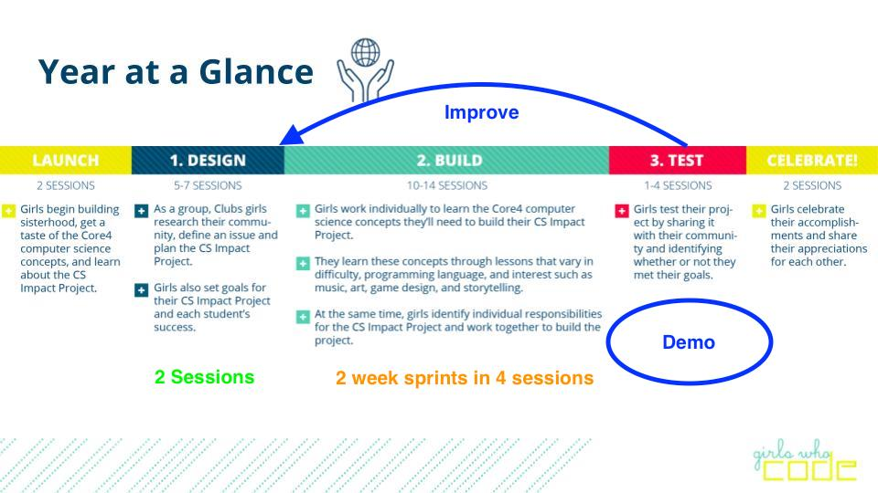

### Retrospective (10 Min)
* How did it go last week? Any questions?
* Is everyone on [Github](https://github.com/)?
* How you liking [Slack](https://slack.com/) for communication?
* Reflection
  * Did you like the drawing exercise?
  * Do you like your Activity Sets? 
    * Too easy/hard? What's up - let me know.
  * Things you didnt care for/dislike
  * Things you want to continue doing?

### Discussion (10 min)
* Projects we are working on:
  * Good News Site
  * Scavenger Hunt Game
    * Split into 2
    * Figure out what each group wants to work on

### Set Goals and Define Success (10 min)
* Draw a simple use case diagram of your app as a team
* Assign work
* Create Swim Lanes
* Demo every 2 weeks

### Group Coding Exercise (15 min)
* Let's talk about [Variables](../master/Core4/variables.md)
* Demo (Swift Playground)
* Look at all 4 in action (Scratch)

### Motivation Tidbit (2 min)
[Video](https://www.youtube.com/watch?v=mFPg96gdPkc)

### Activity Set and/or work on your project (60 min)

### Yoga (optional) (15 min)

### CS Activity Set
* [Select your CS Activity Set](https://docs.google.com/document/d/1LBkpn1TK3J3InwlbLROLHOGvNAEPVR8xRb5Ax1jEF6U/preview#heading=h.x2dqe12x9rpe)
* [Fashion in Scratch](https://drive.google.com/drive/u/0/folders/0B7Y3SK71FWkwSVNLbXEtb0VjNTA)
* [Storytelling in Codesters in Python](https://drive.google.com/drive/u/0/folders/0B7Y3SK71FWkwYkJxN2dqZGZvRUU)
* [Video Games in Actimator](https://drive.google.com/drive/u/0/folders/0B7Y3SK71FWkwdUtvWkNrZi1wYms)
* [Digital Art in Khan Academy in Javascript](https://drive.google.com/drive/u/0/folders/0B7Y3SK71FWkwUG5TeWw0LTVrR0U)
* [Music in EarSketch in Python or Javascript](https://drive.google.com/drive/u/0/folders/0B7Y3SK71FWkwWm9Wb2Fpc2VNaTg0)

### Canvas & Timeline
* [Login](https://girlswhocode.instructure.com/login/canvas)

### Further Explore Coding Environments
* [Scratch](https://scratch.mit.edu/)
* [Block Programming Code.org](https://studio.code.org/s/course4)
* [JavaScript at Code.org](https://code.org/educate/applab)
* [iOS Swift](http://www.apple.com/swift/playgrounds/)
* [Codesters](https://www.codesters.com/)
  * A self-paced environment for learning Python and creating personal projects. Requires an account and password.
* [EarSketch](https://earsketch.gatech.edu/earsketch2/)
  * A platform that lets you compose your own music by programming in Python or JavaScript.
* [Khan Academy](https://www.khanacademy.org/computing/computer-programming/programming/intro-to-programming/a/learning-programming-on-khan-academy)
  * Used for live programming/editing, sharing code, and video resources. 
* [ProcessingJS](http://processingjs.org/)
  * API used to enhance assignments
* [JSFiddle](https://jsfiddle.net/)
  * Used for building websites and sharing code 
* [Fluid UI](https://www.fluidui.com/?utm_source=adwords&utm_campaign=fluid-ui&utm_medium=cpc_term=FluidSearches)
  * Live editor used for building storyboarding/wireframing and building websites 

Please note: Curriculum links are also found in Canvas [Modules](https://girlswhocode.instructure.com/courses/951/modules) as well.  This is just a quickstart. 